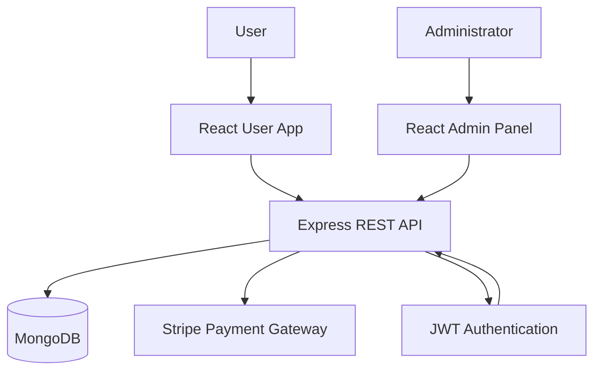
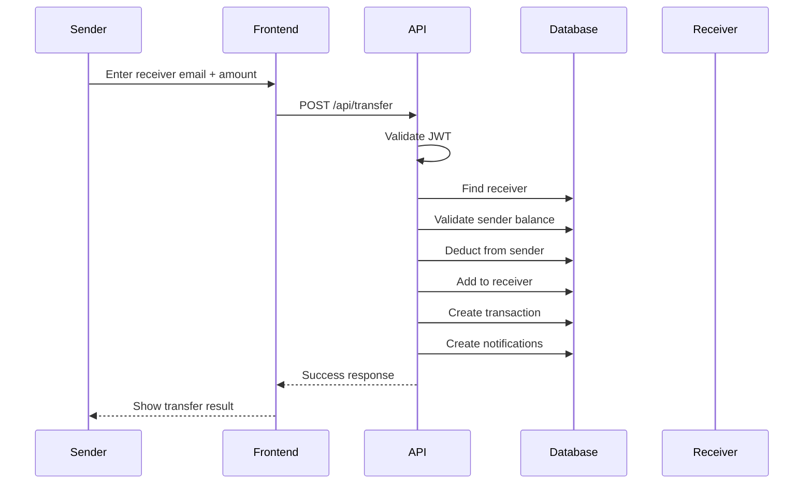
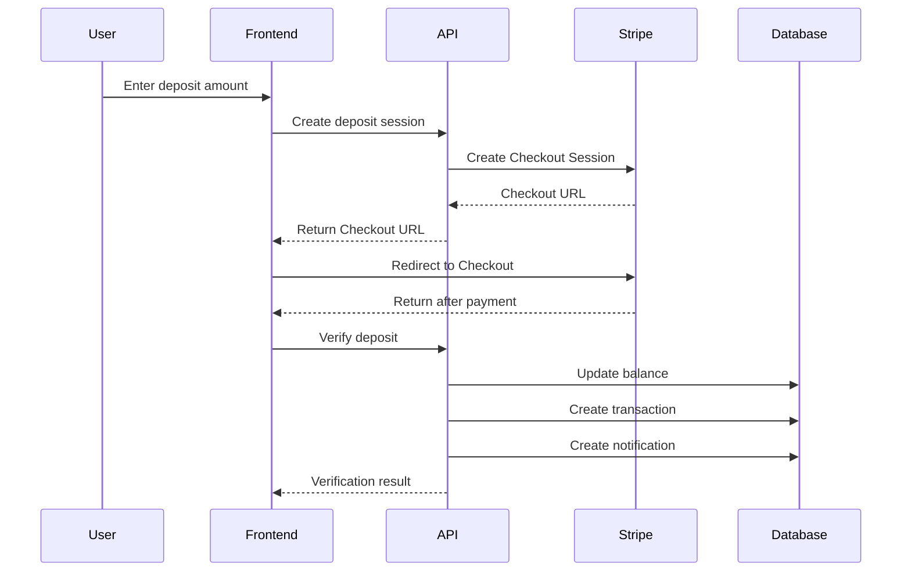
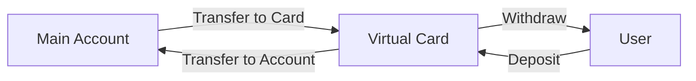
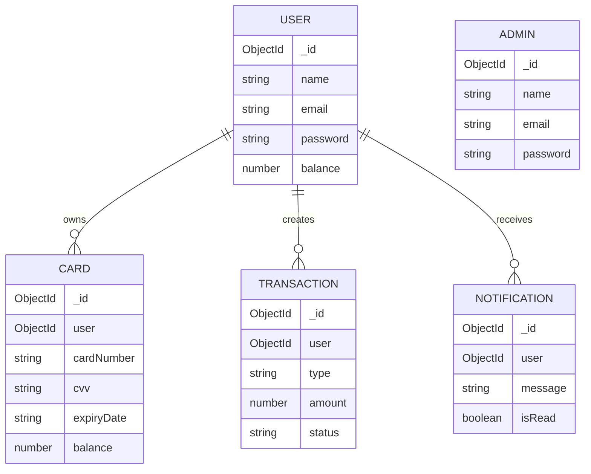

# 🏦 NeoBank

> A modern full-stack digital banking platform built with the MERN stack, designed to simulate core banking operations through a secure and user-friendly web experience.

NeoBank is a full-stack banking application that allows users to manage their account, perform financial transactions, transfer money to other registered users, manage virtual cards, deposit funds through Stripe, and receive transaction notifications.

The system also includes a dedicated **Admin Panel** for monitoring users, cards, and financial activity across the platform.

---

## 📌 Table of Contents

- [About the Project](#-about-the-project)
- [Project Problem](#-project-problem)
- [Our Solution](#-our-solution)
- [Key Features](#-key-features)
- [Technology Stack](#-technology-stack)
- [System Architecture](#-system-architecture)
- [Main Application Flows](#-main-application-flows)
- [Database Design](#-database-design)
- [API Structure](#-api-structure)
- [Project Structure](#-project-structure)
- [Authentication & Security](#-authentication--security)
- [Environment Variables](#-environment-variables)
- [Installation](#-installation)
- [Running the Project](#-running-the-project)
- [Testing](#-testing)
- [Screenshots](#-screenshots)
- [Future Improvements](#-future-improvements)
- [Team](#-team)
- [License](#-license)

---

## 🎯 About the Project

NeoBank was developed as a practical full-stack banking system that brings several common digital banking operations together in one platform.

The project focuses on applying real-world software engineering concepts such as:

- RESTful API design
- JWT-based authentication
- Role-based system separation
- MongoDB data modeling with Mongoose
- Secure financial transaction flows
- Payment gateway integration
- Frontend/backend communication using Axios
- MVC-style backend organization
- Admin system management

---

## ❗ Project Problem

Traditional banking workflows can involve multiple disconnected operations for managing accounts, transferring money, tracking transactions, and controlling spending.

From a software development perspective, building a banking platform also introduces important challenges:

- How can users authenticate securely?
- How can financial operations be validated?
- How can money transfers be performed between different users?
- How can transaction history be stored and tracked?
- How can users separate everyday funds from online spending?
- How can administrators monitor and manage the entire system?

---

## 💡 Our Solution

NeoBank provides a centralized digital banking experience where users can:

- Create and manage their accounts
- Securely log in using JWT authentication
- Deposit and withdraw funds
- Transfer money to other registered users using their email
- Create and manage a virtual card
- Move money between their main account and virtual card
- Track financial transactions
- Receive notifications about important account activity

A separate administration panel gives authorized administrators system-wide visibility and management capabilities.

---

# ✨ Key Features

## 👤 User Features

### 🔐 Authentication

- User registration
- User login
- JWT-based authentication
- Password hashing using bcrypt
- Protected financial routes

### 💰 Account Management

- View account balance
- View personal profile
- Update profile information
- Manage account activity

### 💸 Financial Transactions

- Deposit funds
- Withdraw funds
- View transaction history
- Transfer money to another registered user using their email
- Validate recipient and transfer amount

### 💳 Virtual Cards

Users can generate a virtual card containing:

- 16-digit card number
- CVV
- Expiry date
- Dedicated card balance

The virtual card supports:

- Card deposits
- Account → Card transfers
- Card → Account transfers
- Card balance management

### 🔔 Notifications

Users receive notifications for important financial operations, including:

- Incoming transfers
- Outgoing transfers
- Deposits
- Card-related operations

Users can also mark notifications as read.

---

# 🛡️ Admin Features

NeoBank includes a dedicated administration interface.

### 🔑 Admin Authentication

- Dedicated admin authentication
- Separate Admin model
- Isolated admin functionality

### 👥 User Management

Administrators can:

- View registered users
- Manage user accounts
- Update user balances
- Delete users

### 💳 Card Management

Administrators can:

- View virtual cards
- Monitor cards across the system
- Delete virtual cards when necessary

### 📊 Transaction Monitoring

Administrators can access system-wide transaction information and monitor financial activity.

---

# 🛠️ Technology Stack

| Layer             | Technology                   | Purpose                              |
| ----------------- | ---------------------------- | ------------------------------------ |
| Frontend          | React + Vite                 | User interface and application pages |
| Admin Panel       | React + Vite                 | Administration interface             |
| Backend           | Node.js + Express.js         | REST API and business logic          |
| Database          | MongoDB                      | Persistent data storage              |
| ODM               | Mongoose                     | Database schemas and data modeling   |
| Authentication    | JWT                          | Stateless authentication             |
| Password Security | bcrypt                       | Secure password hashing              |
| Payments          | Stripe                       | Secure deposit checkout              |
| HTTP Client       | Axios                        | Frontend/backend communication       |
| UI / Animation    | Tailwind CSS + Framer Motion | Styling and animations               |
| Icons             | Lucide React                 | Interface icons                      |

---

# 🏗️ System Architecture

NeoBank follows a **Client–Server architecture** with a RESTful API.



### Data Flow

1. The user interacts with the React frontend.
2. The frontend sends HTTP requests using Axios.
3. The Express backend receives the request.
4. Protected routes validate the user's JWT.
5. Controllers execute the required business logic.
6. Mongoose communicates with MongoDB.
7. For deposits, the backend communicates with Stripe.
8. The backend returns a JSON response.
9. The frontend updates the UI based on the response.

---

# 🔄 Main Application Flows

## 💸 Money Transfer Flow



### Transfer Validation

A transfer should verify:

- Receiver email is provided
- Receiver exists
- Transfer amount is valid
- Sender has sufficient balance
- The authenticated user is authorized to perform the operation

---

## 💳 Stripe Deposit Flow



---

## 💳 Virtual Card Flow



The virtual card provides an isolated balance that can be used separately from the user's primary account.

---

# 🗄️ Database Design

NeoBank uses **MongoDB** with **Mongoose** for schema modeling.

## Main Models

| Model          | Purpose                                                            |
| -------------- | ------------------------------------------------------------------ |
| `User`         | Stores user credentials, profile data, and primary account balance |
| `Admin`        | Stores administrator credentials                                   |
| `Card`         | Stores virtual card information and card balance                   |
| `Transaction`  | Stores financial transaction records                               |
| `Notification` | Stores user notifications                                          |

### Relationships



---

# 🔌 API Structure

The backend exposes RESTful API route groups under `/api`.

> **Important:** Protected endpoints require a valid JWT Bearer token.

## Authentication

| Method | Endpoint             | Description         |
| ------ | -------------------- | ------------------- |
| `POST` | `/api/auth/register` | Register a new user |
| `POST` | `/api/auth/login`    | Authenticate a user |

## Users

| Route Group  | Purpose                             |
| ------------ | ----------------------------------- |
| `/api/users` | User profile and account operations |

## Transactions

| Route Group         | Purpose                                        |
| ------------------- | ---------------------------------------------- |
| `/api/transactions` | Deposits, withdrawals, and transaction history |

## Money Transfer

| Method | Endpoint        | Description                                        |
| ------ | --------------- | -------------------------------------------------- |
| `POST` | `/api/transfer` | Transfer money to another registered user by email |

## Virtual Cards

| Route Group              | Purpose                                  |
| ------------------------ | ---------------------------------------- |
| `/api/card`              | Virtual card management                  |
| `/api/card-transactions` | Card deposits and account/card transfers |

## Stripe Deposits

| Route Group    | Purpose                                          |
| -------------- | ------------------------------------------------ |
| `/api/deposit` | Stripe deposit session creation and verification |

## Notifications

| Route Group          | Purpose                                |
| -------------------- | -------------------------------------- |
| `/api/notifications` | Retrieve and manage user notifications |

## Administration

| Route Group               | Purpose                            |
| ------------------------- | ---------------------------------- |
| `/api/admin`              | Core admin operations              |
| `/api/admin/users`        | User administration                |
| `/api/admin/cards`        | Card administration                |
| `/api/admin/transactions` | System-wide transaction monitoring |

---

# 📂 Project Structure

```text
Banking-app/
│
├── Backend/
│   ├── config/
│   │   └── db.js
│   │
│   ├── controllers/
│   │   ├── authController.js
│   │   ├── userController.js
│   │   ├── transactionController.js
│   │   ├── transferController.js
│   │   ├── cardController.js
│   │   ├── cardTransactionController.js
│   │   ├── depositController.js
│   │   ├── notificationController.js
│   │   └── admin controllers
│   │
│   ├── middleware/
│   │   └── authMiddleware.js
│   │
│   ├── Model/
│   │   ├── User.js
│   │   ├── Admin.js
│   │   ├── Card.js
│   │   ├── Transaction.js
│   │   └── Notification.js
│   │
│   ├── routes/
│   │   ├── authRoutes.js
│   │   ├── userRoutes.js
│   │   ├── transactionRoutes.js
│   │   ├── transferRoutes.js
│   │   ├── cardRoutes.js
│   │   ├── cardTransactionRoutes.js
│   │   ├── depositRoutes.js
│   │   ├── notificationRoutes.js
│   │   ├── adminRoutes.js
│   │   ├── adminUserRoutes.js
│   │   ├── adminCardRoutes.js
│   │   └── adminTransactionRoutes.js
│   │
│   └── server.js
│
├── front-end/
│   └── src/
│       ├── api/
│       ├── component/
│       ├── context/
│       └── pages/
│           ├── Login.jsx
│           ├── Register.jsx
│           ├── Dashboard.jsx
│           ├── Transfer.jsx
│           ├── Transactions.jsx
│           ├── Profile.jsx
│           ├── MyCard.jsx
│           ├── Deposit.jsx
│           └── VerifyDeposit.jsx
│
├── admin/
│   └── src/
│       ├── components/
│       ├── pages/
│       └── ...
│
└── README.md
```

---

# 🔐 Authentication & Security

NeoBank implements several security mechanisms.

### Password Security

User and admin passwords are hashed using **bcrypt** before being stored in MongoDB.

### JWT Authentication

After successful authentication, the backend issues a JSON Web Token.

The frontend sends the token in the request header:

```http
Authorization: Bearer <token>
```

### Protected Routes

Sensitive operations such as:

- Transfers
- Withdrawals
- Card operations
- Profile operations
- Notifications

are protected by authentication middleware.

### Admin Isolation

Administrators use a separate authentication flow and `Admin` model, keeping administrative functionality separated from normal user functionality.

> **Security Note:** NeoBank is an educational/portfolio project. A production banking system would require additional security controls, compliance requirements, auditing, fraud detection, rate limiting, stronger validation, and hardened payment verification.

---

# 🔑 Environment Variables

Create a `.env` file inside the `Backend` directory.

```env
PORT=4000

MONGO_URI=your_mongodb_connection_string

JWT_SECRET=your_super_secret_jwt_key

STRIPE_SECRET_KEY=your_stripe_test_secret_key
```

### ⚠️ Important

Never commit `.env` files or secret keys to GitHub.

Add them to `.gitignore`:

```gitignore
.env
.env.*
```

---

# 🚀 Installation and running project

## 1. Clone the Repository

```bash
git clone <https://github.com/abdelrhman9048-dotcom/Banking-app.git>
cd Banking-app
```

## 2. Install Backend Dependencies

```bash
cd Backend
npm install
```

npm reun server

## 3. Install User Frontend Dependencies

```bash
cd ../front-end
npm install
```

npm run dev

## 4. Install Admin Panel Dependencies

```bash
cd ../admin
npm install
```

npm run dev

---

# 🧪 Testing

The project should be tested at both the API and UI levels.

## Authentication Tests

- Register with valid data
- Register with an existing email
- Login with valid credentials
- Login with invalid credentials
- Access protected pages without a token

## Transfer Tests

### Valid Transfer

- Use an email belonging to an existing user
- Enter a valid amount
- Make sure the sender has sufficient balance

Expected result:

- Sender balance decreases
- Receiver balance increases
- Transaction is recorded
- Notifications are created

### Invalid Recipient

Try transferring to an email that does not exist.

Expected result:

```text
User not found
```

### Insufficient Balance

Try transferring an amount greater than the sender's balance.

Expected result:

```text
Insufficient balance
```

### Invalid Amount

Test:

- Empty amount
- Zero
- Negative amount
- Invalid numeric values

## Card Tests

- Generate a card
- Retrieve card information
- Deposit to card
- Transfer account → card
- Transfer card → account
- Verify balances after each operation

## Deposit Tests

- Create Stripe checkout session
- Complete test payment
- Verify deposit
- Confirm balance update
- Confirm transaction creation
- Confirm notification creation

---

# 🔮 Future Improvements

Possible improvements for a production-ready version include:

- [ ] Stripe Webhooks for server-to-server payment verification
- [ ] MongoDB transactions / sessions for stronger atomicity during balance transfers
- [ ] Two-Factor Authentication (2FA)
- [ ] Rate limiting
- [ ] Stronger input validation
- [ ] Transaction audit logs
- [ ] Fraud detection and suspicious activity monitoring
- [ ] Email notifications
- [ ] Password reset flow
- [ ] Pagination and advanced transaction filtering
- [ ] Automated unit and integration tests
- [ ] CI/CD pipeline
- [ ] Production deployment and monitoring

---

# 📚 What We Learned

Building NeoBank helped us practice several real-world full-stack concepts:

### 🔐 Stateless Security

Using JWT authentication and middleware to secure protected APIs.

### 🏗️ API Architecture

Organizing backend code using routes, controllers, models, and middleware.

### 🗄️ Database Design

Using MongoDB and Mongoose to model users, cards, transactions, and notifications.

### 💸 Financial Business Logic

Handling balance updates, transfers, deposits, withdrawals, and validation rules.

### 🔗 Third-Party Integration

Integrating Stripe Checkout into a full-stack application.

### 🐛 Full-Stack Debugging

Tracing problems across the complete flow:

```text
React
  ↓
Axios
  ↓
Express Route
  ↓
Middleware
  ↓
Controller
  ↓
Mongoose
  ↓
MongoDB
```

---

# 👥 Team

This project was developed as a collaborative full-stack application.

| Member                       | Responsibility         |
| ---------------------------- | ---------------------- |
| Abdelrahman Sobhy Abdelhamed | Full-Stack Development |
| Abdullah Emad Issa           | Full-Stack Development |
| Basant Waleed Anter          | Full-Stack Development |
| Khaled Ashrf Rifai           | Full-Stack Development |
| abdulrahman ahmed hosney     | Full-Stack Development |
| Salma Shaker Mohamed         | Full-Stack Development |
| Mahmoud Radi Mohamed         | Full-Stack Development |
| mehada Khaled AbdElaziz      | Full-Stack Development |
|Ahmed Mahmoud Soudi           | Full-Stack Development |


> Replace the placeholder team members with the actual names and responsibilities before publishing the repository.

---

# 📄 License

No license is currently specified.

If this project is later released under an open-source license, add the appropriate license file here.

---

## ⭐ NeoBank

**A full-stack digital banking experience built with React, Node.js, Express, MongoDB, JWT, and Stripe.**

> Built for learning, collaboration, and demonstrating real-world full-stack development concepts.
